# CMSC 412 - Final Project- Demand Paging virtual memory simulator

**Author:** Tyler D Clark  
**Date:** 10 May 2021

**Description** A command line tool for simulating Demand paging algorithms. The program has the following options from the main menu.

0 - exits the program

1 - Read reference string

2 - Generate reference string

3 - Display current reference string

4 - Simulate FIFO

5 - Simulate OPT

6 - Simulate LRU

7 - Simulate LFU

## File Layout

```bash
.
.
├── doc
│   ├── final-project.md
│   └── img
└── src
    └── dev
        └── tylerdclark
            ├── Main.java
            └── Menu.java

```

## UML chart

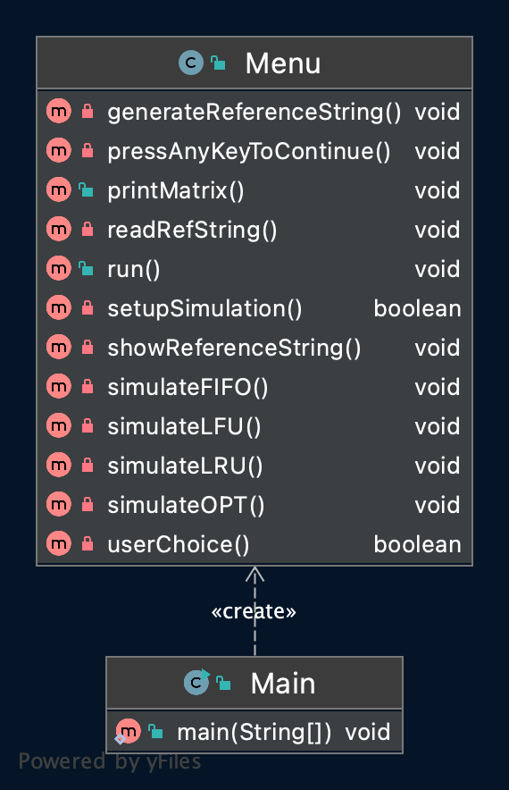

## Runnning the program

Run the program with the following command:

``` bash
java -jar final-project.jar
```

from the out directory

screenshot:

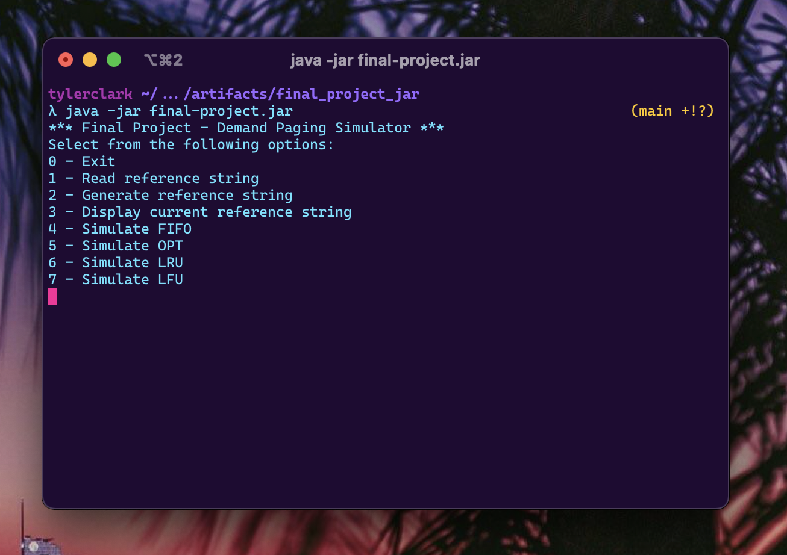

## Testing the program

As per the instructions, testing the program will include using the reference string:

```txt
0 1 2 3 4 5 6 7 8 9 0 9 1 8 2 7 3 6 4 5
```

to test the 4 algorithms with N = 5 physical frames.

### Testing FIFO

Beginning Simulation:

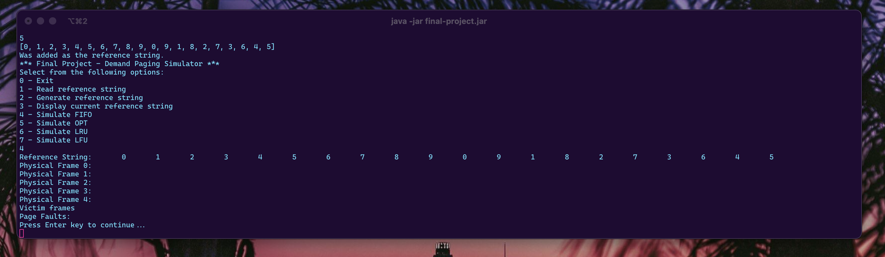

During Simulation:

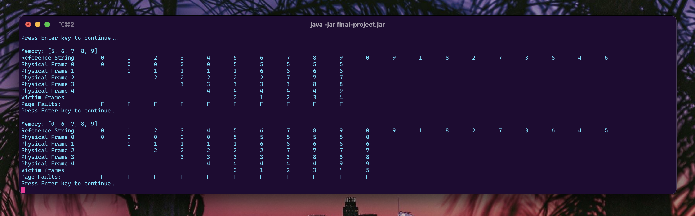

After Simulation:

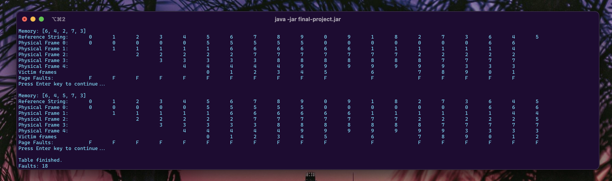

### Testing OPT

Beginning Simulation:

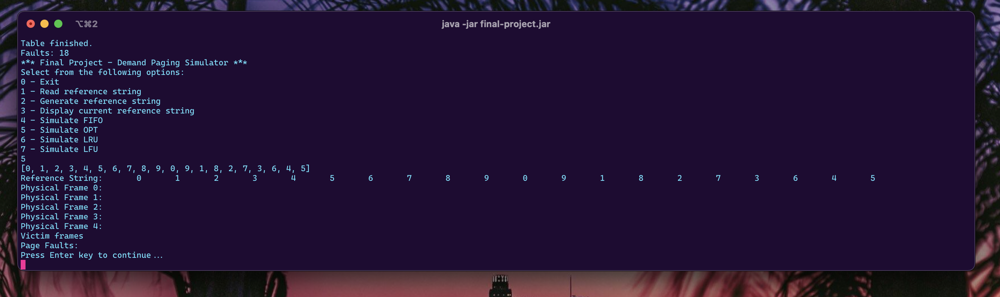

During Simulation:

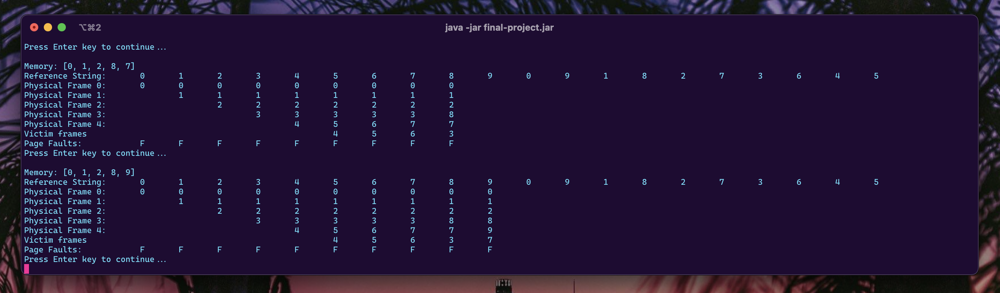

After Simulation:

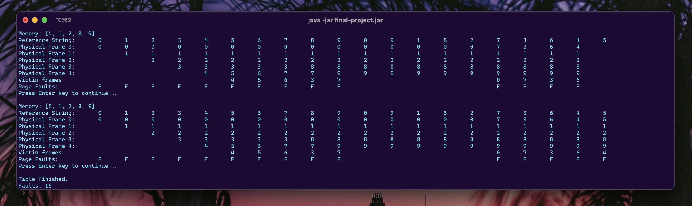

### Testing LRU

Beginning Simulation:

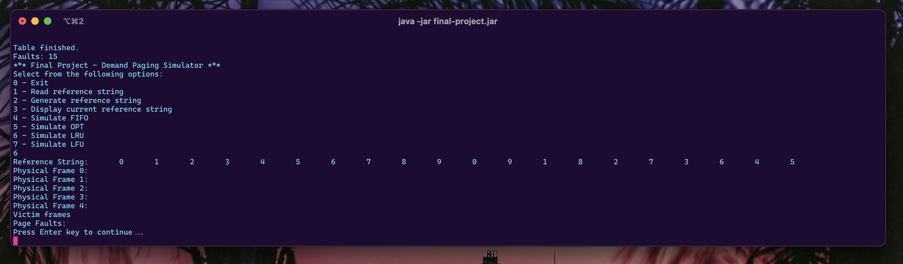

During Simulation:

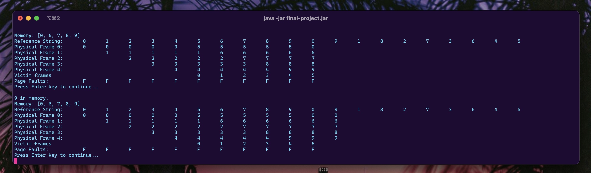

After Simulation:

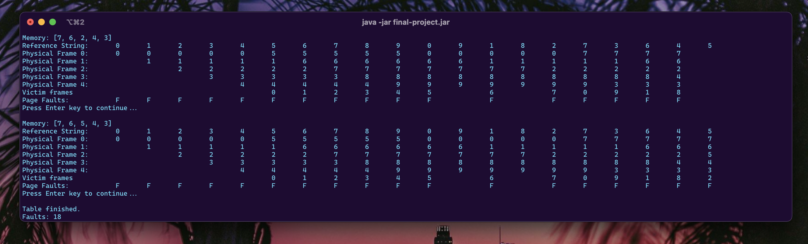

### Testing LFU

Beginning Simulation:

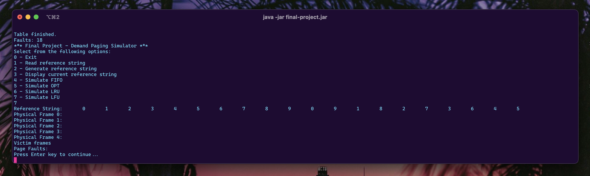

During Simulation:

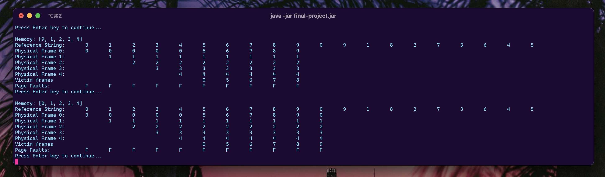

After Simulation:

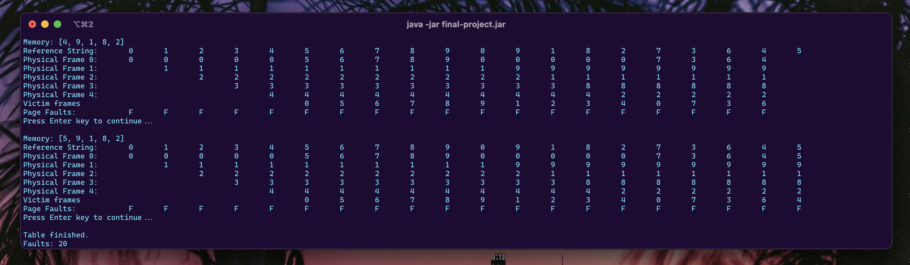
