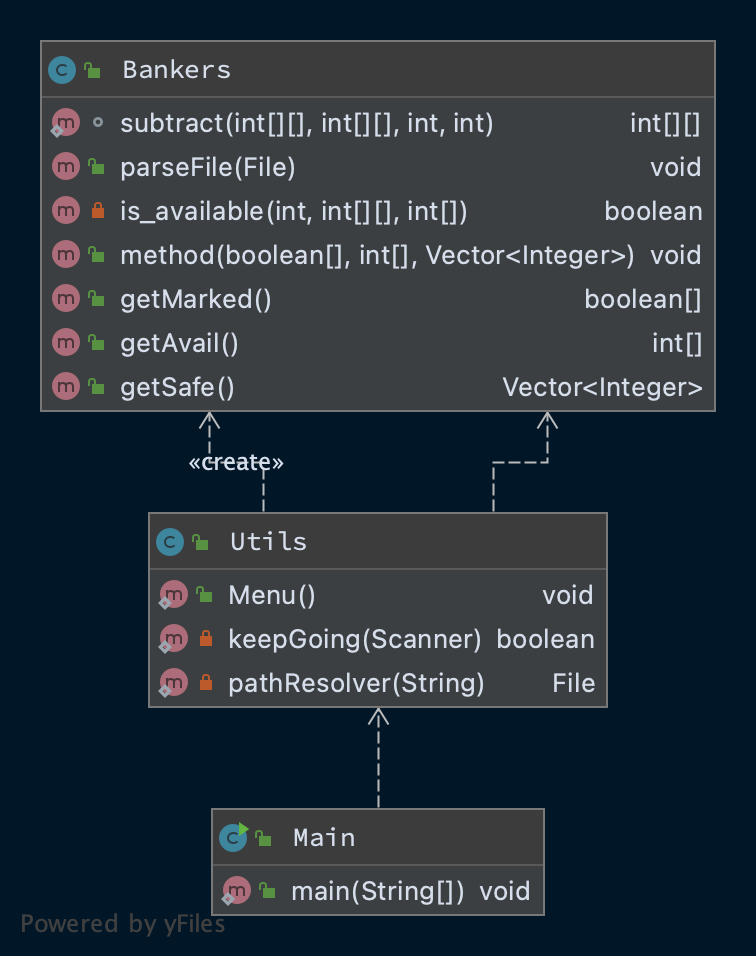
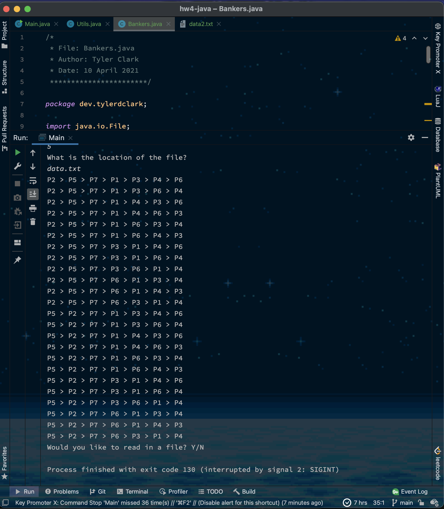

# CMSC 412 - Homework 4 - Banker's algorithm

**Author:** Tyler D Clark  
**Date:** 13 April 2021

**Description** Implemented Banker's algorithm for deadlock avoidance. Using Java for the implementation, with a simple text interface, where the user enters only the name of the input file (text only). The program reads all the necessary input data from that file

___

## File Layout

``` bash
.
├── doc
│    └── hw4.md
└── src
    └── dev
        └── tylerdclark
            ├── Bankers.java
            ├── Main.java
            ├── Utils.java
            ├── data.txt
            └── data2.txt

```

## UML Diagram



Screenshot:


## Discussion

I first wanted to do this with C++, but I found that I was not quite ready for that! I did everything in C++ right up until the implementation of the banker's method. So, I switched over to Java and it was much easier to do. I initially wanted to brute force all of the safe process orders, but I was having some great difficulties. Through some research, I found that I was able to use recursion to solve this problem, so I did. I needed to keep track of which processes have been visited and also A vector was needed because it allowed index access and removal. Overall this was a big learning experience for me.
